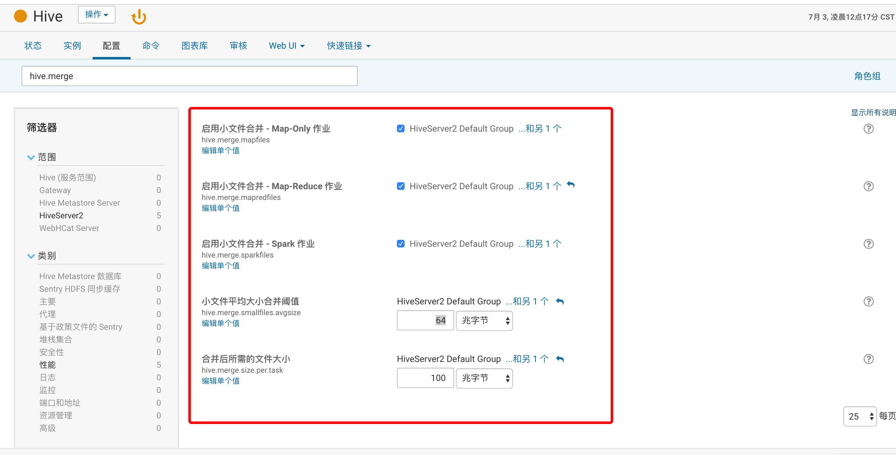
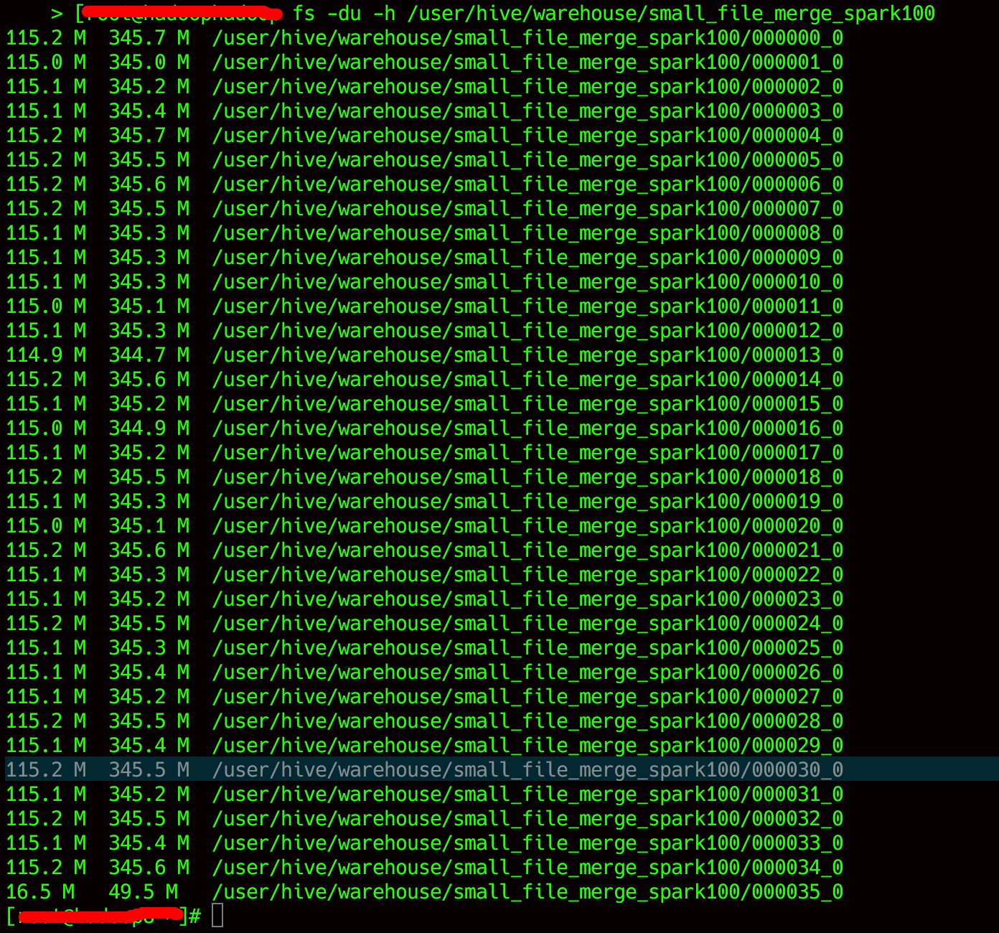

### hive on spark 
hive默认使用mapreduce作为计算引擎，本文介绍如何在cdh6环境中为hive添加spark计算引擎


#### 1.环境
```
cdh6.1.0
```


#### 2.开启hive on spark功能
 
* 集群中添加spark服务，每台node manager添加spark gateway角色，如下图


* hive中的spark配置，如下列表或者如下图

```
1. YARN 服务上的 Spark --> Spark
2. spark.driver.memory --> 1Gb
3. spark.yarn.driver.memoryOverhead --> 1Gb
4. spark.yarn.executor.memoryOverhead --> 2Gb
5. spark.dynamicAllocation.enabled  --> 启用
6. spark.executor.memory --> 2Gb

```


* 重启HiveServer2 & 部署hive客户端配置

#### 3.功能测试

**hive on mapreduce:** 

* 测试语句：

```
SET hive.execution.engine=mr; -- 使用mapreduce计算引擎
SELECT count(1),ip from spark_merge_16mb GROUP BY ip;

```
* 测试结果如下图：


---------------------

**hive on spark:**

* 测试语句：

```
SET hive.execution.engine=spark; -- 使用spark计算引擎
SELECT count(1),ip from spark_merge_16mb GROUP BY ip;
```

* 测试结果如下图：


#### 4.小文件合并功能

> 这是本人比较关注的一个点，产生太多小文件会影响hdfs性能

**4.1 hive中的小文件合并的配置，如下列表或者如下图**
	

```
hive.merge.mapfiles --> 启用
hive.merge.mapredfiles --> 启用
hive.merge.sparkfiles  ---> 启用
hive.merge.smallfiles.avgsize ---> 64Mb (仅作测试使用，生产环境请谨慎设置)
hive.merge.size.per.task   ---> 100Mb (仅作测试使用，生产环境请谨慎设置)（一般设置为hdfs block size，决定hive on spark输出文件的大小）
```




**4.2 重启HiveServer2 & 部署hive客户端配置**


**4.3测试**

4.3.1 源表def的数据大小如下图（大量小文件）：


4.3.2 测试语句

```
SET hive.execution.engine=spark; -- 使用spark计算引擎


create table small_file_merge_spark as 
SELECT rand() as id , * from def
union
SELECT rand() as id , * from def
union
SELECT rand() as id , * from def
union
SELECT rand() as id , * from def
union
SELECT rand() as id , * from def
union
SELECT rand() as id , * from def;

```

4.3.3 执行计划如下图：
可以看出，最后的一个stage是merge task


4.3.4 文件大小如下图：


> 测试结果符合预期


