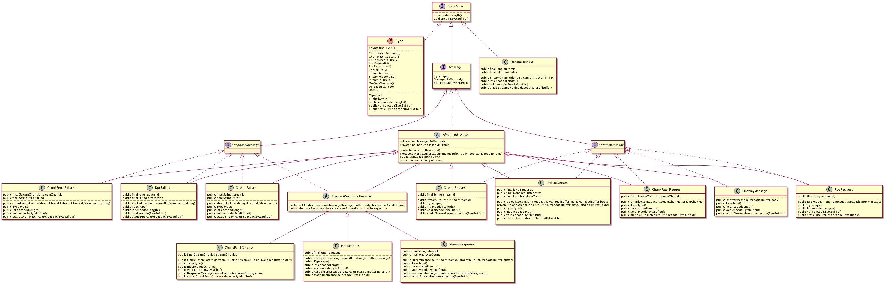
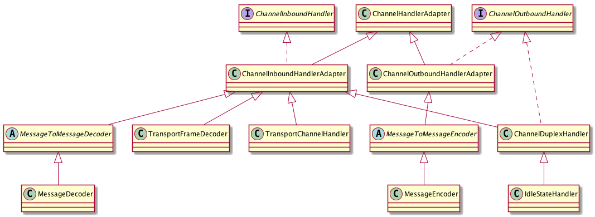

--------------------------------------------------------
#### 1.network-common介绍
network-common模块是基于netty实现的节点间通讯框架，spark rpc模块基于network-common模块实现，network-common模块是spark的基石。


--------------------------------------------------------
#### 2.使用方式
为了让读者有个直观的认识，这里写一个测试例子（先从使用开始嘛）
```
环境 
1. IntelliJ IDEA
2. spark 2.4

ps: 为了方便调试，本人在IntelliJ IDEA上打开了两个spark2.4项目, MyServer.java MyClient.java在不同的项目创建、运行、调试
```

#### 2.1 client端代码<span id="myclient"></span>
```scala
/**
client使用流程：
1.创建TransportConf 和 TransportContext
2.通过TransportContext创建TransportClientFactory
3.通过TransportClientFactory创建TransportClient
4.通过TransportClient注册Callback和发送请求（Stream请求、Chunk请求、Rpc请求）
5.Server端返回，执行Callback


**/

package org.apache.spark.network.mytest;

import org.apache.spark.network.TransportContext;
import org.apache.spark.network.buffer.ManagedBuffer;
import org.apache.spark.network.client.*;
import org.apache.spark.network.server.RpcHandler;
import org.apache.spark.network.server.StreamManager;
import org.apache.spark.network.util.ConfigProvider;
import org.apache.spark.network.util.JavaUtils;
import org.apache.spark.network.util.MapConfigProvider;
import org.apache.spark.network.util.TransportConf;
import org.junit.Test;

import java.io.IOException;
import java.nio.ByteBuffer;
import java.util.HashMap;

public class MyClient {

    @Test
    public void client() {

        // 创建空的TransportConf
        ConfigProvider configProvider = new MapConfigProvider(new HashMap<String, String>());
        TransportConf conf = new TransportConf("test", configProvider);


        // 创建RpcHandler，用于创建TransportContext，此测试用例的client端没有用到RpcHandler，所以这个RpcHandler为空
        RpcHandler rpcHandler = new RpcHandler() {
            @Override
            public void receive(TransportClient client, ByteBuffer message, RpcResponseCallback callback) {

            }

            @Override
            public StreamManager getStreamManager() {
                return null;
            }
        };

        // 创建TransportContext
        TransportContext transportContext = new TransportContext(conf, rpcHandler);

        // 创建TransportClientFactory
        TransportClientFactory transportClientFactory = transportContext.createClientFactory();

        try {

            // 创建连接到127.0.0.1:5633-server端的client
            TransportClient transportClient =
                    transportClientFactory.createClient("127.0.0.1", 5633);

            // 向server端发送内容为"RpcRpc"的Rpc请求，设置回调函数，回调函数将sever端返回的消息打印在控制台
            transportClient.sendRpc(JavaUtils.stringToBytes("RpcRpc"), new RpcResponseCallback() {
                @Override
                public void onSuccess(ByteBuffer response) {
                    String result = JavaUtils.bytesToString(response);
                    System.out.println("rpc response:  " + result);
                }

                @Override
                public void onFailure(Throwable e) {
                    e.printStackTrace();

                }
            });


            // 向server端发送StreamId=1，ChunkIndex=1(这里的StreamId,ChunkIdex可以随便设置，因为测试Server端只会返回内容为"ChunkChunk"的Chunk响应)的Chunk请求，
            // 设置回调函数，回调函数将sever端返回的消息打印在控制台
            transportClient.fetchChunk(1, 1, new ChunkReceivedCallback() {
                @Override
                public void onSuccess(int chunkIndex, ManagedBuffer buffer) {
                    try {
                        System.out.println("chunk response: " + JavaUtils.bytesToString(buffer.nioByteBuffer()));
                    } catch (IOException e) {
                        e.printStackTrace();
                    }
                }

                @Override
                public void onFailure(int chunkIndex, Throwable e) {

                }
            });

            // 向server端发送StreamId="1"(这里的StreamId可以随便设置，因为测试Server端只会返回内容为"StreamStream"的Stream响应)的Stream请求，
            // 设置回调函数，回调函数将sever端返回的消息打印在控制台
            transportClient.stream("1", new StreamCallback() {
                @Override
                public void onData(String streamId, ByteBuffer buf) throws IOException {
                    System.out.println("stream response: " + JavaUtils.bytesToString(buf));

                }

                @Override
                public void onComplete(String streamId) throws IOException {
                }

                @Override
                public void onFailure(String streamId, Throwable cause) throws IOException {
                    cause.printStackTrace();

                }
            });


        } catch (IOException e) {
            e.printStackTrace();
        } catch (InterruptedException e) {
            e.printStackTrace();
        }


        // 主线程睡眠5s，等待netty线程结束
        try {
            Thread.sleep(5000);
        } catch (InterruptedException e) {
            e.printStackTrace();
        }
    }
}


```


#### 2.2 server端代码<span id="myserver"></span>
```scala
/**
server使用流程：

1.创建TransportConf
2.创建StreamManager，用于处理Stream/Chunk请求
3.创建RpcHandler，用于处理Rpc请求
4.创建TransportContext
5.通过TransportContext创建TransportServer


**/
package org.apache.spark.network.mytest;

import com.sun.corba.se.internal.CosNaming.BootstrapServer;
import io.netty.channel.Channel;
import org.apache.spark.network.TransportContext;
import org.apache.spark.network.buffer.ManagedBuffer;
import org.apache.spark.network.buffer.NioManagedBuffer;
import org.apache.spark.network.client.RpcResponseCallback;
import org.apache.spark.network.client.TransportClient;
import org.apache.spark.network.server.RpcHandler;
import org.apache.spark.network.server.StreamManager;
import org.apache.spark.network.server.TransportServer;
import org.apache.spark.network.server.TransportServerBootstrap;
import org.apache.spark.network.util.ConfigProvider;
import org.apache.spark.network.util.JavaUtils;
import org.apache.spark.network.util.MapConfigProvider;
import org.apache.spark.network.util.TransportConf;
import org.junit.Test;

import java.nio.ByteBuffer;
import java.util.ArrayList;
import java.util.Arrays;
import java.util.HashMap;

public class MyServer {

    @Test
    public void servers() {

        // 创建空的TransportConf
        ConfigProvider configProvider = new MapConfigProvider(new HashMap<String, String>());
        TransportConf conf = new TransportConf("test", configProvider);


        // 创建StreamMangere，用于响应Stream/Chunk请求
        StreamManager streamManager = new StreamManager() {
            @Override
            public ManagedBuffer getChunk(long streamId, int chunkIndex) {
                return new NioManagedBuffer(JavaUtils.stringToBytes("ChunkChunk"));
            }

            @Override
            public ManagedBuffer openStream(String streamId) {
                return new NioManagedBuffer(JavaUtils.stringToBytes("StreamStream"));
            }
        };


        // 创建RpcHandler，用于响应，设置回调函数函数，回调函数将client端Rpc请求的消息原样返回
        RpcHandler rpcHandler = new RpcHandler() {
            @Override
            public void receive(TransportClient client, ByteBuffer message, RpcResponseCallback callback) {
                String requestBody = JavaUtils.bytesToString(message);
                callback.onSuccess(JavaUtils.stringToBytes( requestBody));
            }

            @Override
            public StreamManager getStreamManager() {
                return streamManager;
            }
        };

        // 创建TransportContext
        TransportContext  transportContext = new TransportContext(conf, rpcHandler);

        // 创建在127.0.0.1:5633监听的server

        TransportServer transportServer = transportContext.createServer("127.0.0.1", 5633, new ArrayList<TransportServerBootstrap>() );

        // 主线程睡眠10s
        try {
            Thread.sleep(10000);
        } catch (InterruptedException e) {
            e.printStackTrace();
        }

    }
}

```


#### 2.3 测试结果
- client端的输出

```
rpc response:  RpcRpc
chunk response: ChunkChunk
stream response: StreamStream

Process finished with exit code 0

```

- server端的输出

```
Process finished with exit code 0
```

--------------------------------------------------------

#### 3. network-common源码的目录结构
```shell
buffer： 数据缓冲区(一般用于表示消息的内容体(Message body))
client： client端
protocol：消息协议
server：server端
util: 工具类
```


##### 3.1 buffer

buffer的代码比较简单，涉及ManagedBuffer，FileSegmentManagedBuffer， NettyManagedBuffer， NioManagedBuffer,一般用于表示消息的内容体(Message body)


##### 3.1.1 ManagedBuffer
ManagedBuffer以字节的形式为数据提供不可变的视图
##### 3.1.2 ManagedBuffer三种实现：
* 1.FileSegmentManagedBuffer：以文件的形式提供数据
* 2.NioManagedBuffer：以NIO ByteBuffer的形式提供数据
* 3.NettyManagedBuffer：以Netty ByteBuf的形式提供数据 

##### 3.1.3 uml如下图


##### 3.1.4 ManagedBuffer源码注释

```java
public abstract class ManagedBuffer {
  // ManagedBuffer的字节数
  public abstract long size();

  // 将ManagedBuffer的数据暴露为NIO ByteBuffer
  public abstract ByteBuffer nioByteBuffer() throws IOException;

  // 将ManagedBuffer的数据暴露为InputStream
  public abstract InputStream createInputStream() throws IOException;


  // 增加ManagedBuffer的引用计数
  public abstract ManagedBuffer retain();

  // 减少ManagedBuffer的引用计数
  public abstract ManagedBuffer release();

  //将ManagedBuffer转换为Netty对象，返回值为ByteBuf或者FileRegion
  public abstract Object convertToNetty() throws IOException;
}


```
--------------------------------------------------------

#### 3.2 protocol
protocol 定义了消息的协议，例如消息类型，消息编码、解码。

##### 3.2.1 <span id="message_uml">uml如下图</span>



##### 3.2.2 消息介绍
以上uml图看起来非常复杂，其实很简单，接下来从消息的分类、编码解码这两方面来介绍

###### 3.2.2.1 消息分类：
- client端到server端的Request消息：
  - ChunkFetchRequest：向server发送获取流中单个块的请求消息
  - RpcRequest：向server端发送rpc请求消息，由server端的RpcHandler处理
  - StreamRequest：向server端发送获取流式数据的请求消息
  - UploadStream：向server端发送带有数据的Rpc请求消息

- server端到client端的Response消息：
  - Success-Reponse：
	 - ChunkFetchSuccess：处理ChunkFetchRequest成功后返回的响应消息
	 - RpcResponse：处理RpcRequest/UploadStream成功后返回的响应消息
	 - StreamResponse：处理StreamRequest成功后返回的响应消息

  - Fail-Reponse：
  	 - ChunkFetchFailure：处理ChunkFetchRequest失败后返回的响应消息
  	 - RpcFailure：处理RpcRequest/UploadStream失败后返回的响应消息
  	 - StreamFailure：处理StreamRequest失败后返回的响应消息


- 消息类型定义在Message类中的枚举类Type，具体代码如下：

   ```java
	enum Type implements Encodable {
    	ChunkFetchRequest(0), ChunkFetchSuccess(1), ChunkFetchFailure(2),
    	RpcRequest(3), RpcResponse(4), RpcFailure(5),
    	StreamRequest(6), StreamResponse(7), StreamFailure(8),
    	OneWayMessage(9), UploadStream(10), User(-1);

    	private final byte id;

    	Type(int id) {
      		assert id < 128 : "Cannot have more than 128 message types";
     	 	this.id = (byte) id;
    	}
	
    	public byte id() { return id; }
		
		//编码后的字节数	
    	@Override public int encodedLength() { return 1; }
	
		// 将Type对象编码到ByteBuf
    	@Override public void encode(ByteBuf buf) { buf.writeByte(id); }

		// 从ByteBuf解码Type对象
    	public static Type decode(ByteBuf buf) {
      		byte id = buf.readByte();
      		switch (id) {
        		case 0: return ChunkFetchRequest;
        		case 1: return ChunkFetchSuccess;
        		case 2: return ChunkFetchFailure;
        		case 3: return RpcRequest;
        		case 4: return RpcResponse;
        		case 5: return RpcFailure;
        		case 6: return StreamRequest;
        		case 7: return StreamResponse;
        		case 8: return StreamFailure;
        		case 9: return OneWayMessage;
        		case 10: return UploadStream;
        		case -1: throw new IllegalArgumentException("User type messages cannot be decoded.");
        		default: throw new IllegalArgumentException("Unknown message type: " + id);
      		}
    	}
  ```
  
  
###### 3.2.2.1消息的定义与消息的编码解码（针对单个消息）： 

- 消息的定义在Message接口中，如下代码：

	```java
	public interface Message extends Encodable {
  			//消息类型（ChunkRequest,StreamRequest等）
  			Type type();

  			//可选的消息体
  			ManagedBuffer body();
				
			//标识消息体是否在同一个帧中
  			boolean isBodyInFrame();
  			}
	```
		
- 消息的编码解码
	   
	 从[uml](#message_uml)图可以看出，Message接口继承了Encodable接口，所有具体消息都必须实现Encodable接口的encodedLength()，encode方法，这就是消息的编码，同时消息也必须提供decode的静态方法，用于消息的解码（MessageDecoder调用）。Encodable的代码如下：
	
	```java
	   public interface Encodable {
  			// 消息编码后的字节数
  			int encodedLength();

   			// 将此消息编码到ByteBuf
  			void encode(ByteBuf buf);
		}
	```


--------------------------------------------------------

#### 3.3 TransportContext
TransportContext是整个network-common模块的入口类，从[MyClient.java](#myclient)，[MyServer.java](#myserver)可以看出来，TransportClientFactory、TransportServer都是由TransportContext创建，TransportContext除了创建TransportClientFactory、TransportServer，还对Netty channel的pipelines进行设置（client 和 server通过channel进行通信），channel pipelines定义了client端、server端的读写流程。

##### 3.3.1 Netty channel pipelines初始化

步骤如下：

	1.创建TransportChannelHandler, TransportChannelHandler代理了TransportResponseHandler，TransportRequestHandler

	2.设置channel pipelines：注册MessageEncoder， TransportFrameDecoder， MessageDecoder， TransportChannelHandler， IdleStateHandler

	3.返回TransportChannelHandler


###### 3.3.2 nettty pipeline 执行顺序

```
ChannelOutboundHandler 按照注册的先后顺序逆序执行
ChannelInboundHandler  按照注册的先后顺序顺序执行
```

MessageEncoder， TransportFrameDecoder， MessageDecoder， TransportChannelHandler，IdleStateHandler等类的uml如下图：


- MessageEncoder是ChannelOutboundHandler，消息编码器

- TransportFrameDecoder是ChannelInboundHandler，帧解码器(基于tcp/ip的数据传输会有粘包拆包问题，所以需要TransportFrameDecoder将tcp/ip数据流组装成一个有意义的帧)
- MessageDecoder是于ChannelInboundHandler，消息解码器
- IdleStateHandler既是ChannelInboundHandler， 也是ChannelOutboundHandler，心跳检测器
- TransportChannelHandler是ChannelInboundHandler，代理了TransportResponseHandler，TransportRequestHandler，将RequestMessage交给TransportRequestHandler处理，将ResponseMessage交给TransportResponseHandler处理

ChannelOutboundHandler的执行顺序: IdleStateHandler-> MessageEncoder

ChannelInboundHandler的执行顺序：TransportFrameDecoder -> MessageDecoder -> IdleStateHandler -> TransportChannelHandler


>ChannelOutbondHandler，ChannelInboundHandler的执行顺序跟角色无关，不管是client,server都会执行ChannelOutbondHandler，ChannelInboundHandler，因为client,server都需要读取数据(执行ChannelInboundHandler)和发送数据(执行ChannelOutbondHandler)


###### 3.3.3 主要代码如下：

```java

  public TransportChannelHandler initializePipeline(
      SocketChannel channel,
      RpcHandler channelRpcHandler) {
    try {
    	// 创建TransportChannelHandler
      TransportChannelHandler channelHandler = createChannelHandler(channel, channelRpcHandler);
      channel.pipeline()
      	 //注册MessageEncoder
        .addLast("encoder", ENCODER)
        //注册TransportFrameDecoder
        .addLast(TransportFrameDecoder.HANDLER_NAME, NettyUtils.createFrameDecoder())
        // 注册MessageDecoder
        .addLast("decoder", DECODER)
        //注册IdleStateHandler
        .addLast("idleStateHandler", new IdleStateHandler(0, 0, conf.connectionTimeoutMs() / 1000))
        //注册TransportChannelHandler
        .addLast("handler", channelHandler);
      return channelHandler;
    } catch (RuntimeException e) {
      logger.error("Error while initializing Netty pipeline", e);
      throw e;
    }
  }


  private TransportChannelHandler createChannelHandler(Channel channel, RpcHandler rpcHandler) {
    TransportResponseHandler responseHandler = new TransportResponseHandler(channel);
    TransportClient client = new TransportClient(channel, responseHandler);
    TransportRequestHandler requestHandler = new TransportRequestHandler(channel, client,
      rpcHandler, conf.maxChunksBeingTransferred());
    return new TransportChannelHandler(client, responseHandler, requestHandler,
      conf.connectionTimeoutMs(), closeIdleConnections);
  }

```


###### 3.3.4 编码器（发送数据，out方向）
发送数据主要涉及MessageEncoder， MessageEncoder将Message编码成一帧，帧的格式&代码如下：

```
+---------------------------------+-----------------------------------+
|            header               |           body                    |
+---------------------------------+-----------------------------------+
| FrameLength | MsgType | Message |      MessageBody                  |    
+---------------------------------+-----------------------------------+
```

```java
public final class MessageEncoder extends MessageToMessageEncoder<Message> {

  private static final Logger logger = LoggerFactory.getLogger(MessageEncoder.class);

  public static final MessageEncoder INSTANCE = new MessageEncoder();

  private MessageEncoder() {}


  @Override
  public void encode(ChannelHandlerContext ctx, Message in, List<Object> out) throws Exception {
    Object body = null;
    long bodyLength = 0;
    boolean isBodyInFrame = false;

    // If the message has a body, take it out to enable zero-copy transfer for the payload.
    if (in.body() != null) {
      try {
        bodyLength = in.body().size();
        body = in.body().convertToNetty();
        isBodyInFrame = in.isBodyInFrame();
      } catch (Exception e) {
        in.body().release();
        if (in instanceof AbstractResponseMessage) {
          AbstractResponseMessage resp = (AbstractResponseMessage) in;
          // Re-encode this message as a failure response.
          String error = e.getMessage() != null ? e.getMessage() : "null";
          logger.error(String.format("Error processing %s for client %s",
            in, ctx.channel().remoteAddress()), e);
          encode(ctx, resp.createFailureResponse(error), out);
        } else {
          throw e;
        }
        return;
      }
    }
	
	 //消息类型
    Message.Type msgType = in.type();
    //计算header长度
    int headerLength = 8 + msgType.encodedLength() + in.encodedLength();
    //计算frame长度
    long frameLength = headerLength + (isBodyInFrame ? bodyLength : 0);
    //创建header(ByteBuf)
    ByteBuf header = ctx.alloc().heapBuffer(headerLength);
    //将frame长度，MessageType，Message编码到header(ByteBuf)
    header.writeLong(frameLength);
    msgType.encode(header);
    in.encode(header);
    assert header.writableBytes() == 0;

    if (body != null) {
      out.add(new MessageWithHeader(in.body(), header, body, bodyLength));
    } else {
      out.add(header);
    }
  }

}


```

###### 3.3.5 解码器（接收数据，in方向）

接收数据主要涉及以下流程：
TransportFrameDecoder -> MessageDecoder -> IdleStateHandler -> TransportChannelHandler

TransportFrameDecoder：将tcp/ip数据流组装成一个帧， 因为MessageEncoder将消息编码成帧发送，所以数据接收端需要将数据流组装成一帧数据，然后将这帧数据交给MessageDecoder处理

MessageDecoder：从TransportFrameDecoder接收数据，解码成Message交给TransportChannelHandler处理

TransportChannelHandler：消息（RpcRequest，ChunkRequest等消息）的处理器


 

